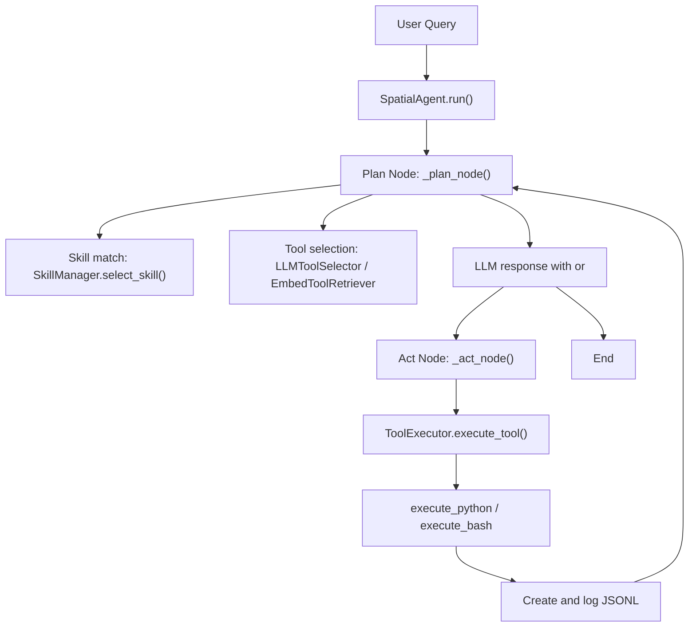
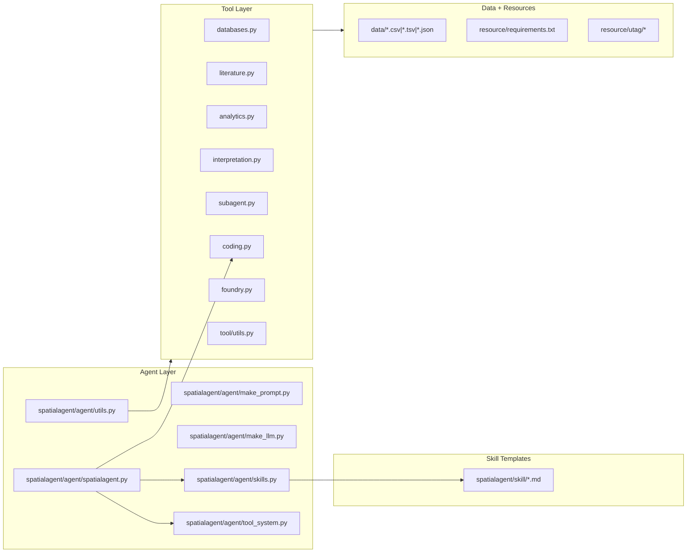

# Spatial Agent 101 (SA101)

This document is a deep, practical onboarding guide to the SpatialAgent codebase.

Scope of this guide:
- Includes the repository under this root.
- Excludes `./apps` (as requested).
- Treats runtime cache artifacts (for example `__pycache__`, `.pyc`, `.DS_Store`) as non-source files.

---

## 1. What SpatialAgent Is

SpatialAgent is a Plan -> Act -> Conclude autonomous analysis system for spatial biology.
At runtime it combines:
- An LLM-driven planner (`spatialagent/agent/spatialagent.py`)
- A dynamic tool registry and retrieval system (`spatialagent/agent/tool_system.py`)
- 72 domain tools (`spatialagent/tool/*.py`)
- Skill templates that steer workflow and tool selection (`spatialagent/skill/*.md`)

The core runtime model is:
1. Plan: LLM decides what to do next.
2. Act: Execute Python/Bash or call tools.
3. Observe: Capture output as `<observation>`.
4. Repeat until `<conclude>`.

---

## 2. Architecture Overview

### 2.1 Runtime Flow



### 2.2 Component Map



---

## 3. Repository Structure At A Glance

```text
.
├── README.md
├── setup_env.sh
├── data/                    # Local biological reference datasets
├── docs/                    # Architecture and retrieval docs
├── resource/                # Dependency list + local UTAG fork
├── spatialagent/
│   ├── agent/               # Orchestration, prompts, LLM factory, retrieval
│   ├── tool/                # 72 tool implementations
│   ├── skill/               # 17 workflow templates
│   └── hooks.py             # Hook framework
├── main.ipynb               # Quickstart notebook
└── teaser.png               # Project figure
```

---

## 4. Complete File Catalog And Use Cases

### 4.1 Root Files

| File | Use case |
|---|---|
| `.gitignore` | Ignores runtime outputs (`experiments`, caches, local IDE files). |
| `LICENSE.txt` | MIT license for this project. |
| `README.md` | Project overview, install instructions, quick usage. |
| `setup_env.sh` | End-to-end conda environment setup and package verification script. |
| `main.ipynb` | Minimal notebook demo showing how to instantiate and run `SpatialAgent`. |
| `teaser.png` | Visual summary image for README/paper-style presentation. |

### 4.2 Data Files (`data/`)

| File | Use case |
|---|---|
| `data/Cell_marker_All.csv` | CellMarker 2.0 marker source for `search_cellmarker2`. |
| `data/PanglaoDB_markers_27_Mar_2020.tsv` | PanglaoDB marker source for `search_panglao`. |
| `data/cell_type_ontology.json` | Hierarchical ontology used by `annotate_cell_types`. |
| `data/czi_census_datasets_v4_short.csv` | Local CZI dataset index used by `search_czi_datasets`. |

### 4.3 Documentation Files (`docs/`)

| File | Use case |
|---|---|
| `docs/architecture.md` | Conceptual description of skill + tool retrieval design. |
| `docs/hooks.md` | Hook event schema, examples, and config format. |
| `docs/local_retrieval.md` | Local embedding configuration and model options. |
| `docs/tool_retrieval_evaluation.md` | Empirical retrieval benchmark across LLM models. |

### 4.4 Resource Files (`resource/`)

| File | Use case |
|---|---|
| `resource/requirements.txt` | Primary Python dependency specification for runtime. |
| `resource/utag/README.md` | Notes on local UTAG fork and compatibility changes. |
| `resource/utag/pyproject.toml` | Build metadata for the local `utag` package. |
| `resource/utag/utag/__init__.py` | Exposes UTAG package entrypoint and version handling. |
| `resource/utag/utag/_version.py` | Placeholder for package version metadata. |
| `resource/utag/utag/segmentation.py` | Core UTAG clustering/message passing implementation. |
| `resource/utag/utag/types.py` | Type aliases and custom `Path` subclass for UTAG internals. |
| `resource/utag/utag/utils.py` | Graph/adjacency utilities used by UTAG algorithms. |
| `resource/utag/utag/vizualize.py` | Visualization helpers for UTAG outputs. |
| `resource/utag/utag.egg-info/PKG-INFO` | Generated package metadata artifact. |
| `resource/utag/utag.egg-info/SOURCES.txt` | Generated source manifest artifact. |
| `resource/utag/utag.egg-info/dependency_links.txt` | Generated packaging artifact. |
| `resource/utag/utag.egg-info/requires.txt` | Generated packaging dependency artifact. |
| `resource/utag/utag.egg-info/top_level.txt` | Generated packaging top-level module artifact. |

### 4.5 SpatialAgent Package Root (`spatialagent/`)

| File | Use case |
|---|---|
| `spatialagent/__init__.py` | Exposes hook APIs at package root. |
| `spatialagent/hooks.py` | Generic hook engine (events, matchers, bash/prompt hooks). |

### 4.6 Agent Orchestration (`spatialagent/agent/`)

| File | Use case |
|---|---|
| `spatialagent/agent/__init__.py` | Public exports (`SpatialAgent`, LLM helpers) and shared model state for subcomponents. |
| `spatialagent/agent/make_llm.py` | LLM factory (Anthropic/OpenAI/Azure/Gemini/Bedrock), embedding backends, cost callback. |
| `spatialagent/agent/make_prompt.py` | Main system prompt with strict `<act>`/`<conclude>` protocol. |
| `spatialagent/agent/skills.py` | Skill/template loading, LLM matching, tool-name extraction from skill markdown. |
| `spatialagent/agent/spatialagent.py` | Main runtime state machine (Plan/Act loop, retrieval, execution, observation logging). |
| `spatialagent/agent/tool_system.py` | Tool registry, embedding retrieval, LLM tool selector, execution wrapper. |
| `spatialagent/agent/utils.py` | Auto-discovers all `@tool` objects from tool modules and configures paths. |

### 4.7 Skill Templates (`spatialagent/skill/`)

| File | Use case |
|---|---|
| `spatialagent/skill/annotation.md` | Workflow for cell type and niche annotation in spatial data. |
| `spatialagent/skill/cell_cell_communication.md` | Workflow for cell-cell communication across conditions. |
| `spatialagent/skill/cell_deconvolution.md` | Workflow for Tangram constrained deconvolution with segmentation. |
| `spatialagent/skill/cellphonedb_analysis.md` | Workflow for CellPhoneDB statistical interaction analysis. |
| `spatialagent/skill/database_query.md` | Workflow for gene set/variant/miRNA/disease database queries. |
| `spatialagent/skill/gene_imputation.md` | Workflow for Tangram-based gene projection/imputation. |
| `spatialagent/skill/liana_analysis.md` | Workflow for LIANA multi-method interaction analysis. |
| `spatialagent/skill/ligand_receptor_discovery.md` | Discovery+validation workflow for ligand-receptor biology. |
| `spatialagent/skill/mapping_validation.md` | QC/validation workflow for Tangram mappings. |
| `spatialagent/skill/multimodal_integration.md` | Workflow for TotalVI/MultiVI/MOFA and batch-aware integration. |
| `spatialagent/skill/panel_design.md` | Iterative marker panel design workflow. |
| `spatialagent/skill/sequence_analysis.md` | Workflow for sequence-centric tasks (BLAST, primer, digestion). |
| `spatialagent/skill/spatial_deconvolution.md` | Workflow for DestVI/Cell2location/Stereoscope/gimVI. |
| `spatialagent/skill/spatial_domain_detection.md` | Workflow for SpaGCN/GraphST spatial domain detection. |
| `spatialagent/skill/spatial_mapping.md` | Workflow for mapping scRNA-seq to spatial coordinates via Tangram. |
| `spatialagent/skill/squidpy_analysis.md` | Workflow for Squidpy neighborhood/spatial statistics. |
| `spatialagent/skill/trajectory_inference.md` | Workflow for scVelo/CellRank/PAGA trajectory analysis. |

### 4.8 Tool Layer (`spatialagent/tool/`)

| File | Use case |
|---|---|
| `spatialagent/tool/README.md` | Catalog and high-level usage docs for all tools. |
| `spatialagent/tool/__init__.py` | Exports tool functions by category. |
| `spatialagent/tool/analytics.py` | Largest tool module with 48 analysis/integration/statistics tools. |
| `spatialagent/tool/coding.py` | Stateful Python REPL and bash execution tools. |
| `spatialagent/tool/databases.py` | Reference DB/API querying tools for markers, tissue expression, disease genes. |
| `spatialagent/tool/foundry.py` | Source inspection tool for reading and adapting tool implementations. |
| `spatialagent/tool/interpretation.py` | LLM-powered annotation and figure interpretation tools. |
| `spatialagent/tool/literature.py` | Literature and web retrieval tools (PubMed/arXiv/Semantic Scholar/web/PDF/DOI). |
| `spatialagent/tool/subagent.py` | Autonomous report and verification subagent tools. |
| `spatialagent/tool/utils.py` | Shared embedding cache/retry/similarity/parser utilities. |

---

## 5. Tool System Deep Dive

### 5.1 How a Tool Is Defined

Tools are simple functions decorated with `@tool` (LangChain Core):

```python
from langchain_core.tools import tool
from typing import Annotated
from pydantic import Field

@tool
def my_tool(
    query: Annotated[str, Field(description="What to search for")],
    save_path: Annotated[str, Field(description="Output folder")] = "./experiments",
) -> str:
    # do work
    return "done"
```

Key conventions in this codebase:
- Use `Annotated[..., Field(description=...)]` for every parameter.
- Return strings for readability in observation logs.
- Do heavy imports inside the tool function when possible.
- Make tools idempotent (skip recompute if output already exists).
- Prefer explicit output paths.

### 5.2 How Tools Are Loaded

`spatialagent/agent/utils.py -> load_all_tools()`:
1. Configures coding/database tool paths.
2. Imports these modules:
   - `spatialagent.tool.databases`
   - `spatialagent.tool.literature`
   - `spatialagent.tool.analytics`
   - `spatialagent.tool.interpretation`
   - `spatialagent.tool.foundry`
   - `spatialagent.tool.coding`
   - `spatialagent.tool.subagent`
3. Reflects over module members and keeps objects with `.name` and `.description` (LangChain tools).

### 5.3 How Tools Become Callable In Generated Code

Inside `SpatialAgent.__init__`:
- Every tool is registered in `ToolRegistry`.
- Tools are wrapped to support both calling styles:
  - Dict style: `tool({"arg": "value"})`
  - Kwarg style: `tool(arg="value")`
- Wrapped functions are injected into the stateful REPL namespace.

So the model can write:

```python
result = search_czi_datasets(query="human liver", n_datasets=3)
```

or:

```python
result = search_czi_datasets({"query": "human liver", "n_datasets": 3})
```

### 5.4 Tool Retrieval Modes

Configured in `SpatialAgent(..., tool_retrieval_method=...)`:
- `llm` (default): LLM selects relevant tools from catalog.
- `embedding`: local embedding similarity (`qwen3-0.6b` by default).
- `all`: load everything (debug/simple scenarios).

Core tools are always loaded (`ALWAYS_LOADED_TOOLS` in `tool_system.py`):
- `execute_python`
- `execute_bash`
- `inspect_tool_code`
- `query_pubmed`
- `web_search`

### 5.5 Skill-Driven Tool Inclusion

`SkillManager.extract_tools_from_skill()` parses tool names in backticks from skill markdown.
Those tools are guaranteed to be included in active tools for the query.

Example in a skill template:

```markdown
Use `search_czi_datasets`, `extract_czi_markers`, and `search_panglao` first.
```

---

## 6. Full Tool Catalog (All 72)

### 6.1 Database Tools (9) - `spatialagent/tool/databases.py`

1. `search_panglao` - Find marker genes from PanglaoDB by cell type/tissue/species.
2. `search_czi_datasets` - Semantic retrieval of CZI CELLxGENE datasets.
3. `search_cellmarker2` - Find marker genes from CellMarker 2.0.
4. `extract_czi_markers` - Pull CZI dataset cell types and marker genes.
5. `download_czi_reference` - Download reference scRNA-seq data from CZI Census.
6. `query_tissue_expression` - Query tissue expression (ARCHS4 via `gget`).
7. `query_celltype_genesets` - Query tissue-relevant cell-type gene sets (Enrichr).
8. `validate_genes_expression` - Validate candidate markers in target tissue.
9. `query_disease_genes` - Query disease-associated genes (GWAS Catalog/OpenTargets).

### 6.2 Literature Tools (7) - `spatialagent/tool/literature.py`

1. `query_pubmed` - Search PubMed and return title/journal/abstract.
2. `query_arxiv` - Search arXiv preprints.
3. `search_semantic_scholar` - Search Semantic Scholar with citation metadata.
4. `extract_url_content` - Pull cleaned text from web pages.
5. `extract_pdf_content` - Extract text from PDFs (direct link or discovered link).
6. `fetch_supplementary_from_doi` - Resolve DOI and extract main/supplementary content.
7. `web_search` - Unified web search wrapper (Anthropic/OpenAI/Google backends).

### 6.3 Analytics Tools (48) - `spatialagent/tool/analytics.py`

#### Core preprocessing and summarization
1. `preprocess_spatial_data`
2. `harmony_transfer_labels`
3. `run_utag_clustering`
4. `aggregate_gene_voting`
5. `infer_dynamics`
6. `summarize_conditions`
7. `summarize_celltypes`
8. `summarize_tissue_regions`

#### Tangram mapping
9. `tangram_preprocess`
10. `tangram_map_cells`
11. `tangram_project_annotations`
12. `tangram_project_genes`
13. `tangram_evaluate`

#### CellPhoneDB
14. `cellphonedb_prepare`
15. `cellphonedb_analysis`
16. `cellphonedb_degs_analysis`
17. `cellphonedb_filter`
18. `cellphonedb_plot`

#### LIANA
19. `liana_tensor`
20. `liana_inference`
21. `liana_spatial`
22. `liana_misty`
23. `liana_plot`

#### Squidpy
24. `squidpy_spatial_neighbors`
25. `squidpy_nhood_enrichment`
26. `squidpy_co_occurrence`
27. `squidpy_spatial_autocorr`
28. `squidpy_ripley`
29. `squidpy_centrality`
30. `squidpy_interaction_matrix`
31. `squidpy_ligrec`

#### Spatial deconvolution/imputation (scvi-tools ecosystem)
32. `destvi_deconvolution`
33. `cell2location_mapping`
34. `stereoscope_deconvolution`
35. `gimvi_imputation`

#### Spatial domain detection
36. `spagcn_clustering`
37. `graphst_clustering`

#### Scanpy helper tools
38. `scanpy_score_genes`
39. `scanpy_ingest`
40. `scanpy_bbknn`

#### Trajectory inference
41. `scvelo_velocity`
42. `scvelo_velocity_embedding`
43. `cellrank_terminal_states`
44. `cellrank_fate_probabilities`
45. `paga_trajectory`

#### Multimodal integration
46. `totalvi_integration`
47. `multivi_integration`
48. `mofa_integration`

### 6.4 Interpretation Tools (3) - `spatialagent/tool/interpretation.py`

1. `annotate_cell_types` - Hierarchical LLM-based cluster annotation.
2. `annotate_tissue_niches` - LLM-based niche annotation using composition/spatial context.
3. `interpret_figure` - Vision model interpretation for generated plots.

### 6.5 Subagent Tools (2) - `spatialagent/tool/subagent.py`

1. `report_subagent` - Multi-pass artifact mining and long-form research report generation.
2. `verification_subagent` - Evidence-based verification of conclusions.

### 6.6 Coding Tools (2) - `spatialagent/tool/coding.py`

1. `execute_python` - Stateful Python execution environment.
2. `execute_bash` - Bash command execution with timeout.

### 6.7 Foundry Tool (1) - `spatialagent/tool/foundry.py`

1. `inspect_tool_code` - Return source code plus helper dependencies of tools.

---

## 7. How The Plan/Act Engine Works (Step-by-Step)

Main file: `spatialagent/agent/spatialagent.py`

1. `SpatialAgent.__init__`
   - Creates tool registry and executor.
   - Loads all tools if not manually provided.
   - Injects tool wrappers into Python REPL.
   - Configures retrieval and skills.
   - Builds LangGraph state machine (`plan` and `act` nodes).

2. `run(user_query, config=...)`
   - Resets per-run retrieval state.
   - Adds `thread_id` (for multi-turn continuation).
   - Streams graph updates until `<conclude>` or recursion limit.

3. `_plan_node(state)`
   - Detects new user message.
   - Optionally selects skill(s).
   - Selects active tools (LLM or embeddings).
   - Injects tool/skill context as hidden system context.
   - Calls LLM and parses for `<act>` or `<conclude>`.

4. `_act_node(state)`
   - Extracts code from `<act>`.
   - Routes to `execute_python` or `execute_bash`.
   - Captures output as `<observation>`.
   - Detects and optionally auto-interprets newly generated figures.
   - Appends observation to memory and JSONL log.

---

## 8. New Developer Tutorial: Build And Extend Tools

This is the fastest practical path if you are new to this repo.

### Step 0: Setup Environment

```bash
cd /Users/ashi/github/SpatialAgent
./setup_env.sh
conda activate spatial_agent
```

Set provider keys as needed:

```bash
export ANTHROPIC_API_KEY=...
export OPENAI_API_KEY=...
export GOOGLE_API_KEY=...
```

### Step 1: Run A Baseline Agent Session

```python
from spatialagent.agent import SpatialAgent, make_llm

llm = make_llm("claude-sonnet-4-5-20250929")
agent = SpatialAgent(llm=llm, save_path="./experiments/demo")
result = agent.run("Find mouse brain cortex datasets from CZI and summarize likely neuronal markers.")
```

### Step 2: Understand Existing Tool Structure

Read in this order:
1. `spatialagent/tool/README.md` (catalog)
2. `spatialagent/tool/databases.py` (small-medium tools)
3. `spatialagent/tool/analytics.py` (advanced long workflows)
4. `spatialagent/agent/utils.py` (autoload mechanics)
5. `spatialagent/agent/tool_system.py` (retrieval and execution model)

### Step 3: Add A New Tool (Recommended Pattern)

Pick the correct module:
- Bio databases -> `databases.py`
- Literature/web -> `literature.py`
- Numerical pipeline -> `analytics.py`
- LLM interpretation -> `interpretation.py`
- Autonomous macro tool -> `subagent.py`

Add a tool:

```python
from langchain_core.tools import tool
from typing import Annotated
from pydantic import Field

@tool
def my_new_analysis_tool(
    adata_path: Annotated[str, Field(description="Path to input .h5ad")],
    save_path: Annotated[str, Field(description="Output directory")] = "./experiments",
) -> str:
    import scanpy as sc
    import os

    os.makedirs(save_path, exist_ok=True)
    output_path = f"{save_path}/my_new_output.txt"
    if os.path.exists(output_path):
        return f"Output already exists at {output_path}"

    adata = sc.read_h5ad(adata_path)
    with open(output_path, "w") as f:
        f.write(f"cells={adata.n_obs}, genes={adata.n_vars}\n")

    return f"Wrote summary to {output_path}"
```

### Step 4: Export The Tool

Update `spatialagent/tool/__init__.py`:
- Import the new tool.
- Add it to `__all__`.

This keeps the public tool API and docs aligned.

### Step 5: Make It Discoverable

If your tool was added to an existing scanned module, `load_all_tools()` will pick it up automatically.
If you created a new module file, also update `tool_modules` map in:
- `spatialagent/agent/utils.py`

### Step 6: Optional Skill Integration

If this tool belongs in a known workflow:
1. Edit or add a skill file in `spatialagent/skill/`.
2. Reference the tool name in backticks (important for extraction), for example:

```markdown
Use `my_new_analysis_tool` after preprocessing.
```

`SkillManager.extract_tools_from_skill()` relies on this pattern.

### Step 7: Test Directly And Through Agent

Direct tool test:

```python
from spatialagent.tool.analytics import preprocess_spatial_data
print(preprocess_spatial_data.invoke({"adata_path": "./data/sample.h5ad", "save_path": "./experiments/test"}))
```

Agent-level test:

```python
result = agent.run("Run my new analysis tool on ./data/sample.h5ad and summarize findings.")
```

### Step 8: Add Docs

Update:
- `spatialagent/tool/README.md` (tool catalog)
- Relevant skill markdown (if workflow-specific)
- Optionally `docs/architecture.md` if architecture-level behavior changed

---

## 9. How To Develop Safely In This Codebase

Use these practical guardrails:

1. Keep output deterministic where possible.
2. Do not silently overwrite outputs; check existence first.
3. Keep heavy imports inside tool functions to reduce startup cost.
4. Return actionable, concise strings from tools.
5. Use explicit paths (`save_path`, `data_path`) in tool interfaces.
6. Prefer additive changes over broad refactors in `analytics.py`.
7. If adding a core dependency, update `resource/requirements.txt` and validate `setup_env.sh`.
8. For long-running computation, add clear progress prints.

---

## 10. Common Extension Points

### A) Add a new retrieval strategy
- Extend `ToolRegistry`/retriever logic in `spatialagent/agent/tool_system.py`.
- Wire strategy in `SpatialAgent.__init__` selection branch.

### B) Add a new model/provider behavior
- Extend `make_llm()` in `spatialagent/agent/make_llm.py`.
- Ensure stop-sequence and token usage behavior are handled.

### C) Add stronger safety policies
- Hook system exists in `spatialagent/hooks.py` and docs in `docs/hooks.md`.
- You can design gating logic with `PreAct` and `PreToolUse`.

### D) Add more skills
- Create markdown under `spatialagent/skill/`.
- Keep tool names in backticks for guaranteed loading.
- Keep workflow concise and procedural.

---

## 11. Important Notes About Non-Source Artifacts

These may appear locally but are not primary source-of-truth:
- `resource/utag/utag.egg-info/*`
- `__pycache__/*`
- `*.pyc`
- `.DS_Store`

This guide focuses on maintainable source and curated data.

---

## 12. Suggested Reading Order For New Contributors

If you have never seen this project:

1. `README.md`
2. `main.ipynb`
3. `spatialagent/agent/spatialagent.py`
4. `spatialagent/agent/tool_system.py`
5. `spatialagent/tool/README.md`
6. `spatialagent/tool/databases.py`
7. `spatialagent/tool/analytics.py`
8. One skill file relevant to your domain (`spatialagent/skill/*.md`)

After that, implement one small tool and run it through the full agent loop.

